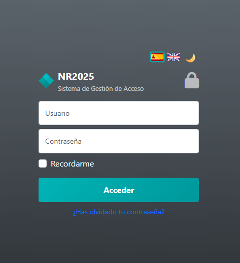

# 📘 Login

[](https://github.com/KVOTHE73/login/actions/workflows/ci.yml)

🔶 Un sistema de gestión de acceso a aplicaciones o login con funcionalidad completa construido con **Vue 3**.

🔶 Permite gestionar el acceso a cualquier aplicación a través de un usuario y una contraseña.

🔶 Validaciones de los inputs con información al usuario de los errores producidos.

🔶 Funcionalidad de restauración de contraseña.

🔶 Traducción en tiempo real y modo oscuro/claro.

🔶 Este proyecto forma parte de mi portfolio y está diseñado para mostrar una implementación profesional de un componente Vue autocontenible y desarrollado con fines exclusivamente didácticos.




---

## 🚀 Tecnologías utilizadas

- [Vue 3](https://vuejs.org/) + Composition API
- [Typescript](https://www.typescriptlang.org/) — Javascript superset
- [Bootstrap](https://getbootstrap.com/) - Conjunto de herramientas para Frontend
- [SASS](https://sass-lang.com/) - Preprocesador de CSS
- [vue-i18n](https://github.com/intlify/vue-i18n-next) — Sistema de traducciones dinámico
- [localStorage API](https://developer.mozilla.org/en-US/docs/Web/API/Window/localStorage) — Persistencia de datos
- [vitest](https://vitest.dev/) - Tests unitarios

---

## 🗂️ Estructura principal

```
src/
├── views/
│   └── Login.vue               # Vista del login
├── assets/
│   └── flags/                  # Banderas de idiomas
├── i18n/
│   └── messages.ts             # Textos de la aplicación en español e inglés para cambio de idioma
├── App.vue                     # Componente raíz
├── main.ts                     # Punto de entrada
└── ...
```

---

## ✨ Funcionalidades

- 🎨 Tema claro / oscuro persistente
- 🌐 Soporte multilenguaje (Español / Inglés)
- ✅ Validación de todos los inputs del formulario
- 📦 Modal para restauración de contraseña
- 🔄 Navegación si el login fur correcto
- 📱 Responsive y optimizado para móviles

---

## 🧩 Estructura del componente

- `template`: Vista con botones de cambio de idioma, cambio de tema, formulario, botones de acceso y modal de restauración de contraseña
- `script setup`: Lógica clara, organizada por bloques funcionales
- `style`: Completamente comentado y contenido en el propio archivo, SASS
- ✅ No requiere ningún CSS externo adicional

---

## 🛠️ Instalación y uso

```bash
# Clona el repositorio
git clone https://github.com/KVOTHE73/login.git
cd login

# Instala dependencias
npm install

# Ejecuta en modo desarrollo
npm run dev
```

📅 Metainformación

📁 Proyecto: Login

🧠 Autor: [Nacho Rodríguez](https://www.nacho-rodriguez.com)

📦 Tipo: Componente Vue 3 autocontenible

🎯 Finalidad: Portfolio personal / Demostración de habilidades frontend

🔗 Licencia: MIT

📣 Puedes ver una demo del proyecto en vivo aquí:
🟢 **[Ver demo online](https://kvothe73.github.io/login)**
